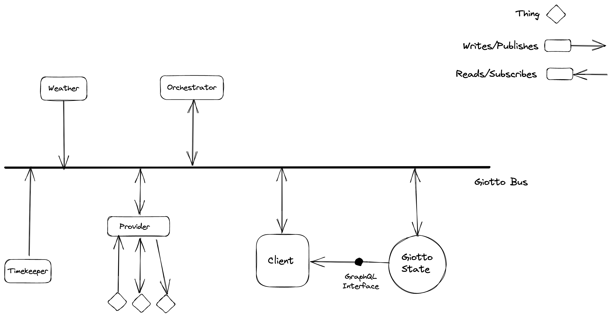

# Architecture

The overall architecture is built around a communication bus called the Giotto bus. By doing this, we can decouple all the components, allowing third parties
the freedom to build clients and providers in their language of choice.

Here's a basic diagram:

## General concepts

It's helpful to start with a few general concepts. The system is made up of Things, Providers and Clients:

 - **Things**: these are the T in IoT. They're sensors, switches, motors, etc. They are the things that communicate with the real world.
 - **Providers**: these act as a bridge between Things and software systems like Giotto. They communicate directly with the Things and relay information back and forth.
 - **Clients**: these are the pieces of software that humans interact with to view information from and send commands to the Things.

It is quite possible for a single piece of software or hardware to act as both a Thing and a Provider or a Provider and a Client. Generally speaking, a Client should not also be a Thing, but if it is, it should not communicate directly with itself.

In addition to these things, there is also a central repository of state that tracks all the information from the Things. Things themselves cannot be queried directly by Clients; Clients query the central State and trust that it is up to date.

## Further Reading

 - [Things](./Things.md)